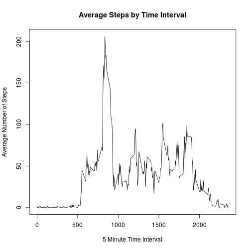

## Loading and preprocessing the data
The First step is to load the data. We will create  a temporary file, download the zip file and extract it into mydata data frame object.

```r
temp_data <- tempfile()
download.file("https://d396qusza40orc.cloudfront.net/repdata/data/activity.zip",temp_data,method="curl")
mydata <- read.csv(unz(temp_data, "activity.csv"),sep=",",na.strings="NA")
unlink(temp_data)
str(mydata)
```

```
## 'data.frame':	17568 obs. of  3 variables:
##  $ steps   : int  NA NA NA NA NA NA NA NA NA NA ...
##  $ date    : Factor w/ 61 levels "2012-10-01","2012-10-02",..: 1 1 1 1 1 1 1 1 1 1 ...
##  $ interval: int  0 5 10 15 20 25 30 35 40 45 ...
```

## What is mean total number of steps taken per day?

```r
library(doBy)
sumedData <- summaryBy(steps ~ date, data=mydata, FUN=c(sum),na.rm=T)
hist(sumedData$steps.sum,xlab="Total number of steps (blue-mean; red-median)",ylab="Frequency",main="Histogram of Steps")
meanSteps <- round(mean(sumedData$steps.sum,na.rm=T), 2)
medianSteps <- round(median(sumedData$steps.sum,na.rm=T), 2)
abline(v=meanSteps, lwd = 3, col = 'blue')
abline(v=medianSteps, lwd = 3, col = 'red')
```

 

The daily Average steps is 9354.23 
the daily median Steps is 1.0395 &times; 10<sup>4</sup>


## What is the average daily activity pattern?

```r
IntervalSumedData <- summaryBy(steps ~ interval, data=mydata, FUN=c(mean),na.rm=T)
plot(IntervalSumedData$interval,IntervalSumedData$steps.mean,type="l",xlab="5 Minute Time Interval",ylab="Average Number of Steps",main="Average Steps by Time Interval")
```

 

```r
maxInterval<-IntervalSumedData[which.max(IntervalSumedData$steps.mean),]
```

interval number 104 have the maximun average steps. 
this the 835 minute with average of 206.17 steps

## Imputing missing values

Total number of missing values is


```r
sum(is.na(mydata$steps))
```

```
## [1] 2304
```

We replace the NA with the 5-minute interval average


```r
imputeData<-mydata
for (i in which(is.na(imputeData$steps))){
        imputeData$steps[i]<-round(IntervalSumedData$steps.mean[IntervalSumedData$interval==
                                                                        imputeData$interval[i]],0)
}
sum(is.na(imputeData$steps))
```

```
## [1] 0
```

```r
imputedSumedData <- summaryBy(steps ~ date, data=imputeData, FUN=c(sum),na.rm=T)
hist(imputedSumedData$steps.sum,xlab="Total number of steps (blue-mean; red-median)",ylab="Frequency",main="Histogram of Steps (Imputed Dataset)")
imputedMeanSteps <- round(mean(imputedSumedData$steps.sum,na.rm=T), 2)
imputedMedianSteps <- round(median(imputedSumedData$steps.sum,na.rm=T), 2)
abline(v=imputedMeanSteps, lwd = 3, col = 'blue')
abline(v=imputedMedianSteps, lwd = 3, col = 'red')
```

 

The daily Average steps in the imputed data set is 1.076564 &times; 10<sup>4</sup> compeared with 9354.23 in the non-imputed one.

the daily median Steps in the imputed data set is 1.0762 &times; 10<sup>4</sup> compeared with 1.0395 &times; 10<sup>4</sup> in the non-imputed one.

Answer To Question: The mean and the median are now the same and higher than in the original dataset.

## Are there differences in activity patterns between weekdays and weekends?

```r
library(lattice)
Sys.setlocale("LC_TIME", "C")
```

```
## [1] "C"
```

```r
isweekend = function(x){
        wday<-weekdays(strptime(x,"%Y-%m-%d"))
        if(wday %in% c('Saturday', 'Sunday')){
                return("weekend")
        }
        return("weekday")
}
imputeData$daytype = as.factor(apply(as.matrix(imputeData$date), 1, isweekend))
imputedIntervalSumedData <- summaryBy(steps ~ interval+daytype, data=imputeData, FUN=c(mean),na.rm=T)

xyplot(steps.mean~interval | daytype, data = imputedIntervalSumedData,
      type = 'l',
      xlab = 'Interval',
      ylab = 'Number of Steps',
      layout = c(1,2))
```

 
